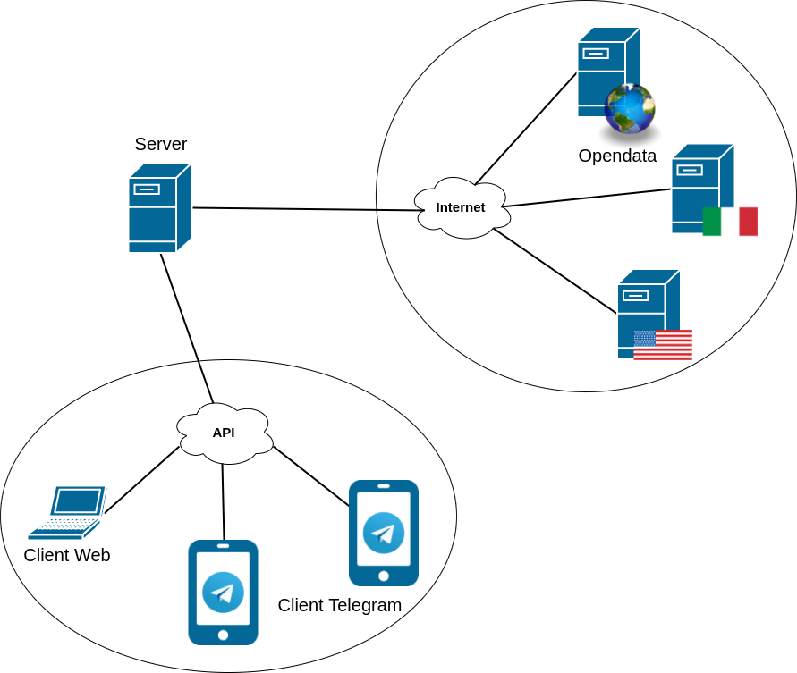
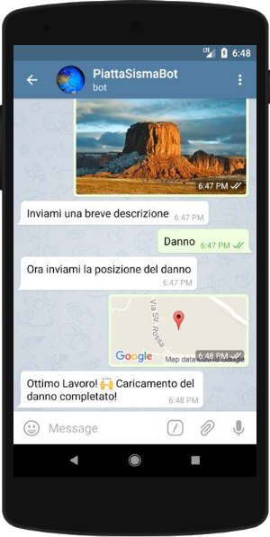

# 🌎 PiattaSisma 🌍 #
-----------------------------------------------------

## Progetto Piattaforme Digitali per la Gestione del Territorio ##

### Appello: ###
* Primo appello sessione estiva 2017/2018

### Alunni: ###
* [Andrea Mancini](http://github.com/Andrea101288)
* [Dawid Węglarz](http://github.com/Radeox)

-----------------------------------------------------

## Descrizione ##

Il progetto _PiattaSisma_ si pone come obbiettivi primari:
* Raccogliere dati sismici da diverse fonti e resituirli in un formato standard
* Catalogare i danni causati da eventi sismici e dare accesso a questi dati per eventuali studi/interventi

## English ##

The _PiattaSisma_ project stands as primary objectives:
* Collect sismic data from different sources and return them in a standard format
* Catalog the damage caused by seismic events and give access to these data for any studies / interventions

-----------------------------------------------------

## Relazione ##

Il progetto è composto da 3 obbiettivi principali:
 * Realizzazione di un API (GET e POST) in Python (Django Framework)
 * Implementazione di una piattaforma Web (HTML, PHP, JS, CSS)
 * Implementazione di due BotTelegram (PHP e Python)
 
Altri obbiettivi secondari:
 * Sfruttare più linguaggi e tecnologie possibili
 * Condividere le conoscenze nel Team
 * HAVE FUN!

Lo scenario che abbiamo immaginato è il seguente, ma è importante notare che **questo progetto può essere ancora ampliato e arricchito con nuove funzionalità**.

## English Description ##

The project is composed of 3 main objectives:
 * Realization of an API (GET and POST) in Python (Django Framework)
 * Implementation of a Web platform (HTML, PHP, JS, CSS)
 * Implementation of two BotTelegrams (PHP and Python)
 
Other secondary objectives:
 * Exploit more languages ​​and possible technologies
 * Share knowledge in the Team
 * HAVE FUN!

The scenario we imagined is the following, but it is important to note that ** this project can still be expanded and enriched with new features **.

-----------------------------------------------------

### PiattaSisma API ###
* Realizzazione di un API (GET e POST) con Django framework e relativa [documentazione](https://app.swaggerhub.com/apis/RadeAndry9588/PiattaSismaAPI/1.0.0-oas3):
   * Acquisizione di dati sismici da alcuni siti la quale mettono a disposizione OpenData tra cui:
     * [**INGV** - Istituto Nazionale di Geofisica e Vulcanologia](http://cnt.rm.ingv.it/)
     * [**USGS** - United States Geological Survey](https://earthquake.usgs.gov/)
     * [**Data.gov** - U.S. Government’s open data](https://www.data.gov/)

   * Gli step dell'algoritmo per l'acquisizione dei dati sui terremoti, che poi verrano restituiti in formato GeoJSON, sono i seguenti:
     1. Effettuta una richiesta HTTP per accedere ai dati desiderati
     2. Effettuta il parsing dei dati ricevuti attraverso l'opportuna funziona
     3. Codifica i dati ottenuti che ci interessano in un nuovo GeoJSON
     5. Restituisce il GeoJSON

   * Gli step dell'algoritmo della POST dei danni sul sito sono i seguenti:
     1. Controlla che l'utente che ha mandato la richiesta esista nel database
     2. Decodifica la richiesta ricevuta
     3. Decodifica immagine (codificata in [Base64](https://it.wikipedia.org/wiki/Base64))
     4. Salva il nuovo oggetto danno nel database
     
I dati vengono raccolti da diversi siti attraverso dei [parser](https://it.wikipedia.org/wiki/Parsing) che estraggono i dati dal sito e li convertono in un formato standard ([GeoJSON](http://geojson.org)). I siti per cui abbiamo implementato dei parser sono tutti siti di Opendata in formato [QuakeML](https://en.wikipedia.org/wiki/QuakeML) ma pur essendo uno standard presentano ancora piccole differenze che non permettono la corretta interpretazione dei dati. Per questo abbiamo pensato di rendere i parser dei moduli che possono essere intergrati agilmente nel codice senza influire sul resto. Per questioni di dimensioni di dati richiesti tramite API abbiamo optato inserire di default un arco temporale di 30 gg poichè abbiamo notato che aumentando molto il numero di giorni le richieste comportano tempi importanti e soprattutto alcuni siti hanno un limite massimo di dati da trasmettere.

### English PiattaSisma API ###

* Creation of an API (GET and POST) with Django framework and related [documentation] (https://app.swaggerhub.com/apis/RadeAndry9588/PiattaSismaAPI/1.0.0-oas3):
   * Acquisition of seismic data from some sites which make OpenData available including:
     * [** INGV ** - National Institute of Geophysics and Volcanology] (http://cnt.rm.ingv.it/)
     * [** USGS ** - United States Geological Survey] (https://earthquake.usgs.gov/)
     * [** Data.gov ** - U.S. Government’s open data] (https://www.data.gov/)

   * The steps of the algorithm for the acquisition of earthquake data, which will then be returned in GeoJSON format, are the following:
     1. Make an HTTP request to access the desired data
     2. After parsing the data received through the appropriate function
     3. Encode the obtained data that interest us in a new GeoJSON
     5. Returns the GeoJSON

   * The steps of the POST damage algorithm on the site are as follows:
     1. Check that the user who sent the request exists in the database
     2. Decode the received request
     3. Image decoding (encoded in [Base64] (https://it.wikipedia.org/wiki/Base64))
     4. Save the new object damage in the database
     
Data is collected from different sites through [parsers] (https://it.wikipedia.org/wiki/Parsing) which extract data from the site and convert it into a standard format ([GeoJSON] (http: // geojson .org)). The sites for which we have implemented parsers are all Opendata sites in [QuakeML] format (https://en.wikipedia.org/wiki/QuakeML) but despite being a standard they still have small differences that do not allow the correct interpretation of the data . This is why we thought of making module parsers that can be easily integrated into the code without affecting the rest. For questions of data size requested through API we opted to insert a time frame of 30 days by default as we have noticed that increasing the number of days very much the requests involve important times and above all some sites have a maximum data limit to be transmitted.

-----------------------------------------------------

### PiattaSisma (Client Web) ###

* Implementazione di una piattaforma Web (HTML, PHP, JS, CSS) che permetta di:
  * Aggiunta di nuovi danni causati da eventi sismici correlati da foto, descrizione e posizione del danno
  * Utilizzare le API descritte al punto precedente per la ricerca tra i vari OpenData e il posizionamento dei dati attraverso dei marker sulla mappa fornita da Google Maps
  * Gestire la registrazione e l'accesso degli utenti
  * Permette di amministrare dati e utenti attraverso un interfaccia admin
  
* La piattafroma è composta dai seguesti file principali:
  * **Index**: Pagina di benvenuto nella piattaforma dove si effettua il login e/o la registrazione
  * **Register**: Acquiscisce i dati richiesti dal utente che verranno verificati dalla pagina **RegisterCheck**. Se questi passano i controlli allora l'utente potrà entrare
  * **Login**: Semplice pagina che permette il login degli utenti registrati attaverso **LoginCheck** che verfica la corettezza delle credenzali immesse
  * **homePage**: Pagina principale della piattaforma dove appare una mappa che sarà popolata dai vari eventi restituiti dal API. Una serie di filtri permette di effettuare ricerche più o meno precise in base alla posizone e/o al tempo
  * **Damages**: Galleria dei danni
  * **AddDamage**: dove si può caricare nuovi danni che verranno validati attraverso **DamageCheck**
  * **AboutUs**: Si può trovare una piccola descrizione del progetto e il motivo che ci hanno portato a realizzarlo
  * **ContactUs**: Raccoglie i contatti dei creatori della piattaforma
  
 ### English PiattaSisma (Client Web) ###
  
  * Implementation of a Web platform (HTML, PHP, JS, CSS) that allows:
  * Addition of new damage caused by seismic events related to photos, description and location of the damage
  * Use the APIs described in the previous point to search between the various OpenData and the positioning of the data using markers on the map provided by Google Maps
  * Manage user registration and access
  * It allows to manage data and users through an admin interface
  
* The platform is composed of the following main files:
  * ** Index **: Welcome page on the platform where you log in and / or register
  * ** Register **: Acquires the data requested by the user which will be verified by the ** RegisterCheck ** page. If these pass the checks then the user can enter
  * ** Login **: Simple page that allows the login of registered users through ** LoginCheck ** that verifies the correctness of the credentials entered
  * ** homePage **: Main page of the platform where a map appears that will be populated by the various events returned by the API. A series of filters allows more or less precise searches based on the position and / or time
  * ** Damages **: Damage gallery
  * ** AddDamage **: where you can upload new damage that will be validated via ** DamageCheck **
  * ** AboutUs **: You can find a small description of the project and the reason that led us to realize it
  * ** ContactUs **: Collects the contacts of the creators of the platform
  
-----------------------------------------------------

### PiattaSismaBot ###

PiattaSismaBot è il bot pensato per gli utenti della piattaforma troppo ~~pigri~~ di fretta per poter usare il Client Web.
Il bot permettere di segnalare un danno in pochi semplici passi direttamente da Telegram sfruttando le API di PiattaSisma.
Questo bot è stato realizzato in PHP e si interfaccia alla API di Telegram in modo "nativo".

I comandi che il bot mette a disposizione sono i seguenti:

  * _/earthquakes_: permette di ricevere la posizione e una descrizione dei terremoti avvenuti nel raggio di 10km da una location specificata dall'utente
  * _/damage_: permette di segnalare dei danni causati da un terremoto con una foto, posizione e una breve descrizione
  * _/info_: restituisce informazioni generiche sul Bot
  * _/help_: restituisce dettagli sui comandi e come utilizzarli

 

### English PiattasismaBot ###

PiattaSismaBot is the bot designed for users of the platform too ~~ lazy ~~ in a hurry to use the Web Client.
The bot allows you to report a damage in a few simple steps directly from Telegram using the API of PiattaSisma.
This bot was made in PHP and interfaces to the Telegram API in a "native" way.

The commands that the bot provides are the following:

  * _ / earthquakes_: allows you to receive the position and a description of earthquakes that occurred within a 10km radius from a location specified by the user
  * _ / damage_: allows you to report damage caused by an earthquake with a photo, location and a brief description
  * _ / info_: returns generic information about the Bot
  * _ / help_: returns details about the commands and how to use them
</ Div>  

-----------------------------------------------------

### TechSismaBot ###

 

TechSismaBot al contrario è ideato per poter consultare i danni che si sono verificati in una certa zona in un raggio di 10km. L'utente non deve far altro che mandare un comando e mandare la location desiderata per vedere tutti i dati.
 Questo bot è stato realizzato in Python e si interfaccia alla API di Telegram tramite la libreria [Telepot](https://github.com/nickoala/telepot)
 
I comandi che il bot mette a disposizione sono i seguenti:

  * _/get\_damages_: Permette di cercare danni in un raggio di 10km da una certa posizione

### English TechSismaBot ###

TechSismaBot on the other hand is designed to be able to see the damage that has occurred in a certain area within a 10km radius. All the user has to do is send a command and send the desired location to see all the data.
 This bot was created in Python and interfaces with the Telegram API through the library [Telepot] (https://github.com/nickoala/telepot)
 
The commands that the bot provides are the following:

  * _ / get \ _damages_: Allows you to search for damage within a 10km radius from a certain location
</ Div>
-----------------------------------------------------

### Links e riferimenti ###
 * Link Client web: http://piattasisma.ddns.net
 * Link API terremoti (esempio Italia): http://piattasisma.ddns.net/api/earthquakes/italy
 * Link API danni (esempio): http://piattasisma.ddns.net/api/damages
 * Link PiattaSismaBot: https://telegram.me/PDGTESbot
 * Link TechSismaBot: https://telegram.me/TechSismaBot
 * Link alla documentazione del API: https://app.swaggerhub.com/apis/RadeAndry9588/PiattaSismaAPI/1.0.0-oas3
